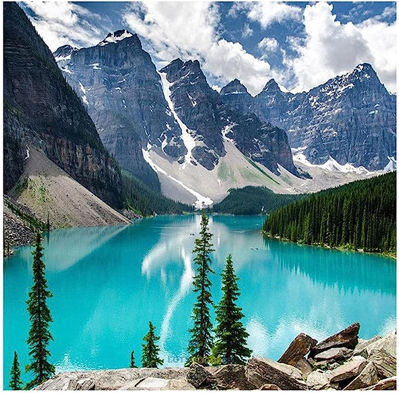

# Escena

La imagen muestra un lago en Canadá. En primer plano, se ve un lago tranquilo y transparente, rodeado de altas montañas cubiertas de vegetación. El cielo despejado se refleja perfectamente en la superficie del agua, creando un efecto espejo. A lo largo de la orilla, se encuentran árboles como pinos y abetos, que crean una franja verde vibrante. En el fondo, se vislumbra una cadena montañosa majestuosa, cuyos picos nevados contrastan con el resto de la escena.

